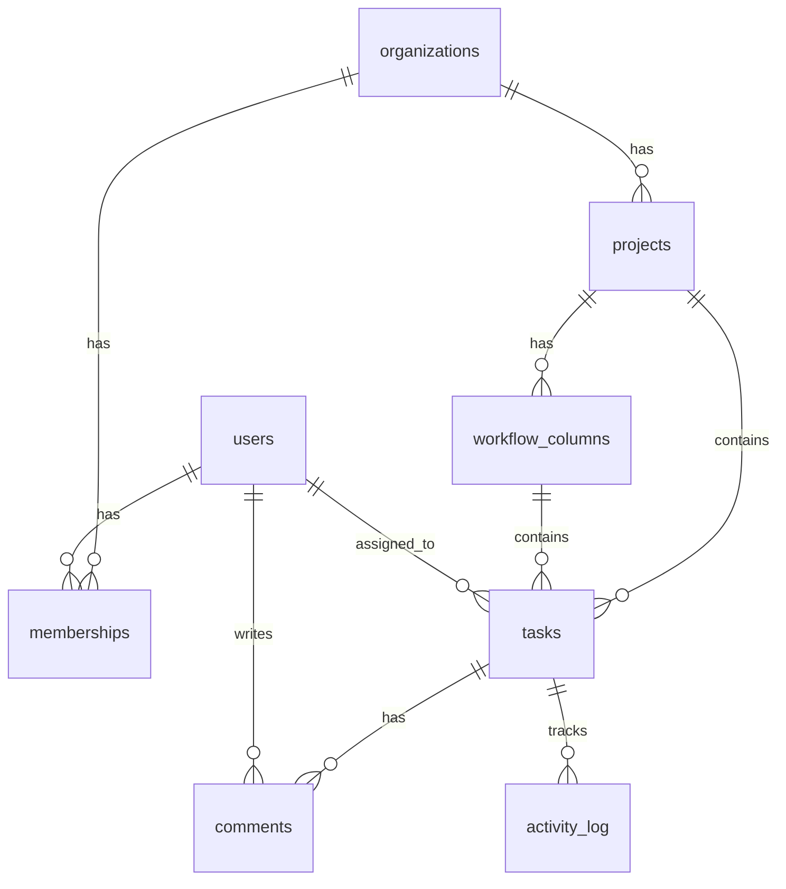

# Tutorial: Build a SaaS Task Manager from Zero

> **Time:** 45-60 minutes to read, 1-2 days to follow along
> **Skill Level:** Intermediate (some web dev experience, new to AI-assisted development)
> **What you'll build:** A team task management app (think simplified Linear)
> **Stack:** Next.js, TypeScript, PostgreSQL, Tailwind CSS
> **Starter Kit:** `saas-web-app`

This tutorial walks you through building a real SaaS application using the Prompt Catalog from start to finish. At each step, you'll see:

1. **Which prompt to use** and why it's next
2. **How to fill in the variables** for this specific project
3. **What the AI produces** (representative output)
4. **What the prompt caught** that you might have missed

By the end, you'll have a complete specification, architecture, data model, threat model, and implementation plan — before writing a single line of application code.

---

## Table of Contents

- [Step 0: Set Up the Catalog](#step-0-set-up-the-catalog)
- [Step 1: Gather Functional Requirements (PLAN-REQ-001)](#step-1-gather-functional-requirements)
- [Step 2: Define Non-Functional Requirements (PLAN-REQ-002)](#step-2-define-non-functional-requirements)
- [Step 3: Write User Stories (PLAN-REQ-003)](#step-3-write-user-stories)
- [Step 4: Design System Architecture (ARCH-SYS-001)](#step-4-design-system-architecture)
- [Step 5: Design the Database (ARCH-DATA-001)](#step-5-design-the-database)
- [Step 6: Threat Model (SEC-THREAT-001)](#step-6-threat-model)
- [Step 7: Implement a Feature (DEV-WEB-001)](#step-7-implement-a-feature)
- [Step 8: Write Tests (TEST-UNIT-001)](#step-8-write-tests)
- [Step 9: What the Prompts Caught](#step-9-what-the-prompts-caught)
- [What's Next](#whats-next)

---

## Step 0: Set Up the Catalog

First, install the CLI and load the starter kit:

```bash
# Option A: Install from PyPI
pip install prompt-catalog

# Option B: Install from source
git clone https://github.com/KevinRabun/prompt-catalog.git
cd prompt-catalog/server
pip install -e .
```

Now see what the `saas-web-app` kit recommends:

```bash
prompt-catalog kit show saas-web-app
```

Output:
```
╭─ SaaS Web Application ──────────────────────────────────────────╮
│                                                                  │
│  Full-stack SaaS application with web frontend, API backend,     │
│  database, authentication, multi-tenancy, and CI/CD.             │
│                                                                  │
│  Prompts (12):                                                   │
│    Planning:    PLAN-REQ-001, PLAN-REQ-002, PLAN-REQ-003         │
│    Architecture: ARCH-SYS-001, ARCH-DATA-001                     │
│    Development: DEV-WEB-001, DEV-API-001                         │
│    Security:    SEC-THREAT-001, SEC-CODE-001                     │
│    Testing:     TEST-UNIT-001, TEST-INT-001                      │
│    Deployment:  DEPLOY-CICD-001                                  │
│                                                                  │
│  Instructions (6):                                               │
│    guardrails/accuracy, guardrails/security, platforms/web,      │
│    phases/design, phases/implementation, phases/testing           │
│                                                                  │
╰──────────────────────────────────────────────────────────────────╯
```

The kit gives us 12 prompts in a specific order and 6 instruction files. We'll follow the order: planning → architecture → security → development → testing.

**Before you start:** Load the instruction files into your AI agent. If you're using Claude, VS Code Copilot, or Cursor, copy the instruction files from `instructions/` into your project:

```bash
prompt-catalog kit export saas-web-app --output ./my-taskmanager/.prompts
```

This copies the relevant instruction files so your AI agent sees them automatically.

---

## Step 1: Gather Functional Requirements

**Prompt:** `PLAN-REQ-001` — Functional Requirements Elicitation
**Why it's first:** You can't design what you haven't defined. This prompt forces clarity before code.

### Fill in the variables

```yaml
project_name: "TaskFlow"
project_type: "web application"
target_users: "small-to-medium development teams (5-50 people)"
project_description: >
  A team task management application where teams can create projects,
  track tasks through customizable workflows (e.g., Backlog → In Progress
  → Review → Done), assign tasks to team members, and visualize progress.
  Similar to Linear or Asana but simpler.
```

### What you give the AI

Copy the prompt from the catalog (or use `prompt-catalog show PLAN-REQ-001 --raw` to get it), then replace the `{{variables}}`:

> You are a requirements analyst helping to gather functional requirements for a software project.
>
> **Project Context:**
> - Project Name: TaskFlow
> - Project Type: web application
> - Target Users: small-to-medium development teams (5-50 people)
> - Brief Description: A team task management application where teams can create projects, track tasks through customizable workflows...
>
> *(rest of the prompt)*

### What the AI produces (representative)

The AI generates a structured requirements document. Here's a subset:

```
REQ-FUNC-001: User Registration and Authentication
  "As a team lead, I want to create an account and invite my team
   so that we can start tracking work together."
  Acceptance Criteria:
    Given I am a new user,
    When I sign up with email and password,
    Then my account is created and I receive a confirmation email.
  Priority: Must Have

REQ-FUNC-002: Project Creation
  "As a team lead, I want to create projects with a name and description
   so that I can organize work by initiative."
  Priority: Must Have

REQ-FUNC-003: Custom Workflow Columns
  "As a project admin, I want to define workflow stages (columns)
   so that tasks follow our team's actual process."
  Priority: Must Have

REQ-FUNC-007: Task Assignment
  "As a team member, I want to assign tasks to people
   so that everyone knows what they're responsible for."
  Priority: Must Have

REQ-FUNC-012: Activity Feed
  "As a team member, I want to see a history of changes on a task
   so that I know what happened while I was away."
  Priority: Should Have

REQ-FUNC-015: Notifications
  "As a team member, I want to be notified when I'm assigned a task
   or mentioned in a comment so that I don't miss important updates."
  Priority: Should Have
```

### What the prompt caught

Notice what the prompt forced the AI to do that a freeform "build me a task manager" wouldn't:

- **Every requirement has an ID.** You can reference `REQ-FUNC-007` in architecture discussions later.
- **Every requirement has acceptance criteria.** "Assign tasks" is vague; "Given a task exists, when I select a team member from the dropdown, then the task shows their avatar and they receive a notification" is testable.
- **The AI asked clarifying questions.** It didn't assume whether you wanted real-time updates, what "team" means (single team vs. multi-team org), or whether you need a mobile view.
- **It flagged missing areas.** The prompt's "Notifications" and "Reporting & Analytics" sections forced the AI to ask about those even though the original description didn't mention them.

> **Without the prompt,** you'd get: "Here's a Next.js app with a tasks table." The requirements step seems slow, but it prevents building the wrong thing.

---

## Step 2: Define Non-Functional Requirements

**Prompt:** `PLAN-REQ-002` — Non-Functional Requirements
**Why it's next:** NFRs drive architecture decisions. You can't choose between PostgreSQL and DynamoDB without knowing your scale.

### Fill in the variables

```yaml
project_name: "TaskFlow"
project_type: "web application"
deployment_target: "Vercel (frontend) + Railway or AWS (backend + DB)"
expected_users: "Initially 10 teams (~100 users), growing to 500 teams (~5,000 users) in year one"
regulatory_environment: "SOC 2 Type II (future), GDPR for EU users"
```

### What the AI produces (subset)

```
NFR-PERF-001: Page Load Time
  Target: < 2 seconds for initial load, < 500ms for subsequent navigation
  Measurement: Lighthouse performance score ≥ 90

NFR-PERF-002: API Response Time
  Target: p50 < 100ms, p95 < 500ms, p99 < 1s
  Measurement: Application Performance Monitoring (APM)

NFR-SCALE-001: Concurrent Users
  Target: Support 500 concurrent users with < 5% performance degradation
  Measurement: Load testing with k6 or Artillery

NFR-AVAIL-001: Uptime
  Target: 99.9% uptime (8.7 hours downtime/year)
  Measurement: Uptime monitoring (Pingdom, UptimeRobot)
  Note: 99.9% is appropriate for a project management tool; 99.99% would
        require multi-region deployment which isn't justified at this scale.

NFR-SEC-001: Authentication
  Target: Support email/password + social login (Google, GitHub)
  Must support MFA for admin accounts
  Measurement: Security audit checklist

NFR-SEC-003: Data Encryption
  Target: TLS 1.3 in transit, AES-256 at rest for database
  Measurement: SSL Labs A+ rating, database encryption verification
```

### What the prompt caught

- **Measurable targets, not vibes.** "The system should be fast" became "p95 < 500ms, measured by APM." This is a testable specification.
- **Scale-appropriate decisions.** The AI noted that 99.99% uptime isn't justified for a task manager at this stage — it recommended 99.9% and explained the difference in operational cost. Without the prompt, many AI agents default to "99.99% uptime" because it sounds good.
- **GDPR surfaced early.** Even though the app doesn't seem "compliance-heavy," the prompt's Section 5 (Compliance & Data Sovereignty) forced the AI to ask about EU users. Since you said yes, the architecture now needs to account for data residency.

---

## Step 3: Write User Stories

**Prompt:** `PLAN-REQ-003` — User Stories and Acceptance Criteria
**Why it's next:** Break requirements into sprint-sized deliverables.

### Fill in the variables

```yaml
feature_description: >
  Task management core — creating, editing, assigning, and moving tasks
  through workflow columns within a project. Includes drag-and-drop
  board view and list view.
user_roles: "team member, project admin, organization owner"
feature_prefix: "TASK"
```

### What the AI produces (subset)

```
US-TASK-001: Create a Task
  As a team member,
  I want to create a new task with a title and optional description,
  So that I can capture work items quickly.

  Acceptance Criteria:
    Given I am on the project board,
    When I click "New Task" and enter a title,
    Then the task is created in the first workflow column.

    Given I am creating a task,
    When I leave the title empty and try to save,
    Then I see a validation error and the task is not created.

  Story Points: 3
  Dependencies: US-TASK-000 (Project board page exists)

US-TASK-003: Move Task Between Columns
  As a team member,
  I want to drag a task card from one column to another,
  So that I can update the task's workflow status.

  Acceptance Criteria:
    Given I see a task card in the "In Progress" column,
    When I drag it to the "Review" column,
    Then the task's status updates and the card appears in "Review."

    Given two team members are viewing the same board,
    When one moves a task,
    Then the other sees the update within 5 seconds (without refreshing).

  Story Points: 5
  Dependencies: US-TASK-001
  Notes: Real-time update (5s) requirement from NFR-PERF discussion.
         Consider WebSocket or SSE for live updates.

US-TASK-005: Assign Task to Team Member
  As a project admin,
  I want to assign a task to a team member,
  So that responsibility is clear.

  Acceptance Criteria:
    Given I am editing a task,
    When I select a team member from the assignee dropdown,
    Then the task shows their avatar and the assignee receives a notification.

    Given a task is assigned to me,
    When I view "My Tasks,"
    Then this task appears in my personal task list.

  Story Points: 3
  Dependencies: US-TASK-001, User management feature
```

### What the prompt caught

- **The INVEST checklist in the prompt** forced the AI to split "Task CRUD" (way too big for a sprint) into independent stories: create, edit, assign, move, delete — each one independently shippable.
- **Edge cases in acceptance criteria.** The empty title validation, the real-time update requirement, and the "My Tasks" view all emerged from the prompt's insistence on complete acceptance criteria.
- **Cross-references.** The stories reference NFR-PERF requirements and each other via Dependencies. This creates tractability from requirements through to implementation.

---

## Step 4: Design System Architecture

**Prompt:** `ARCH-SYS-001` — System Architecture Design
**Why it's next:** You have requirements. Now decide how to build it.

### Fill in the variables

```yaml
project_name: "TaskFlow"
project_type: "SaaS task management platform"
requirements_summary: >
  Must support 500 concurrent users, p95 API response < 500ms,
  99.9% uptime. Core features: projects with customizable workflow
  columns, task CRUD with drag-and-drop, real-time board updates,
  team management with roles, activity feed, notifications.
  GDPR compliance for EU users. SOC 2 future target.
target_platforms: "web-only (responsive for mobile browsers)"
expected_scale: "5,000 users, 500 concurrent, ~50 req/sec peak"
deployment_target: "Vercel (frontend) + managed PostgreSQL (Railway/Neon/Supabase)"
```

### What the AI produces (key excerpts)

```
## ADR-001: Monolith vs. Microservices

Status: Decided
Context: TaskFlow serves 5,000 users with 50 req/sec peak traffic.
Decision: **Modular monolith** (Next.js full-stack with API routes)
Alternatives Considered:
  - Microservices: Rejected. At this scale, the operational overhead
    (service discovery, distributed tracing, multiple deployments)
    far outweighs the benefits. A team of 1-5 developers cannot
    effectively operate microservices.
  - Serverless functions: Considered but rejected for real-time features
    (WebSocket connections for board updates don't fit cold-start model).
Consequences: Must enforce module boundaries in code (use barrel exports,
  separate concerns by feature folder) to enable future decomposition.

## ADR-002: Real-Time Strategy

Status: Decided
Context: Board updates need to appear within 5 seconds (NFR-PERF).
Decision: **Server-Sent Events (SSE)** for real-time board updates.
Alternatives:
  - WebSocket: More complex, bidirectional (not needed — updates flow
    server → client). WebSocket reconnection handling adds complexity.
  - Polling: Simpler but wasteful at 5-second intervals with many boards.
Decision: SSE provides server-push with automatic reconnection,
  works through HTTP/2, and fits the unidirectional update pattern.

## Component Architecture

┌──────────────────────────────────────────────────────────┐
│                     Vercel Edge                          │
│  ┌──────────────┐  ┌──────────────┐  ┌───────────────┐ │
│  │  Next.js SSR  │  │  Static CDN  │  │  Edge MW      │ │
│  │  + API Routes │  │  (assets)    │  │  (auth check) │ │
│  └──────┬───────┘  └──────────────┘  └───────────────┘ │
│         │                                                │
│  ┌──────▼──────────────────────────────────────────────┐ │
│  │              Application Modules                     │ │
│  │  ┌────────┐ ┌────────┐ ┌────────┐ ┌──────────────┐│ │
│  │  │ Auth   │ │ Tasks  │ │ Teams  │ │ Notifications ││ │
│  │  │ Module │ │ Module │ │ Module │ │ Module        ││ │
│  │  └────────┘ └────────┘ └────────┘ └──────────────┘│ │
│  └──────┬───────────────────────────────────────────────┘ │
│         │                                                │
│  ┌──────▼───────┐  ┌──────────────┐  ┌───────────────┐ │
│  │  PostgreSQL   │  │    Redis     │  │  S3 / R2      │ │
│  │  (Neon)       │  │  (Upstash)   │  │  (file store) │ │
│  └──────────────┘  └──────────────┘  └───────────────┘ │
└──────────────────────────────────────────────────────────┘
```

### What the prompt caught

This is where the catalog earns its keep:

- **The monolith was the right call.** Without the prompt, many AI agents default to recommending microservices because it sounds "modern." The prompt's insistence on *"Consider operational complexity — can the team operate this?"* and *"at least 2 alternatives"* forced an honest evaluation. A solo developer or small team cannot operate microservices at this scale.
- **SSE over WebSocket was justified with trade-offs.** The prompt required ADRs (Architecture Decision Records) with alternatives. The AI didn't just pick a technology — it explained why SSE fits better than WebSocket for this specific use case.
- **Cost was considered.** The prompt asks for cost implications, so the AI recommended Neon (managed PostgreSQL with a free tier) instead of RDS ($50+/month minimum).

---

## Step 5: Design the Database

**Prompt:** `ARCH-DATA-001` — Data Architecture
**Why it's next:** The architecture decided on PostgreSQL. Now design the schema.

### Fill in the variables

```yaml
system_name: "TaskFlow"
primary_use_case: >
  OLTP — task creation, status updates, assignment changes.
  Read-heavy on board views (list all tasks in a project grouped by column).
  Write-moderate on task updates (status changes, comments).
data_characteristics: >
  Relational data — organizations, teams, projects, columns, tasks, comments,
  activity logs. Starting at <1GB, growing ~500MB/year. Multi-tenant by
  organization.
query_patterns: >
  1. Get all tasks in a project grouped by workflow column (board view)
  2. Get tasks assigned to a user across all projects (my tasks)
  3. Get activity feed for a task (comments + status changes, chronological)
  4. Search tasks by title/description within a project
  5. Dashboard: task counts by status per project
compliance_requirements: "GDPR — EU user data, right to deletion, data export"
```

### What the AI produces (key excerpts)

```sql
-- Core schema (simplified for tutorial)

CREATE TABLE organizations (
    id          UUID PRIMARY KEY DEFAULT gen_random_uuid(),
    name        VARCHAR(100) NOT NULL,
    slug        VARCHAR(100) NOT NULL UNIQUE,
    created_at  TIMESTAMPTZ NOT NULL DEFAULT now(),
    updated_at  TIMESTAMPTZ NOT NULL DEFAULT now()
);

CREATE TABLE projects (
    id              UUID PRIMARY KEY DEFAULT gen_random_uuid(),
    organization_id UUID NOT NULL REFERENCES organizations(id),
    name            VARCHAR(200) NOT NULL,
    description     TEXT,
    created_at      TIMESTAMPTZ NOT NULL DEFAULT now(),
    -- Tenant isolation: every query MUST filter by organization_id
    CONSTRAINT idx_projects_org UNIQUE (organization_id, id)
);

CREATE TABLE workflow_columns (
    id          UUID PRIMARY KEY DEFAULT gen_random_uuid(),
    project_id  UUID NOT NULL REFERENCES projects(id) ON DELETE CASCADE,
    name        VARCHAR(100) NOT NULL,
    position    INTEGER NOT NULL,  -- Sort order for board display
    created_at  TIMESTAMPTZ NOT NULL DEFAULT now(),
    CONSTRAINT uq_column_position UNIQUE (project_id, position)
);

CREATE TABLE tasks (
    id              UUID PRIMARY KEY DEFAULT gen_random_uuid(),
    project_id      UUID NOT NULL REFERENCES projects(id),
    column_id       UUID NOT NULL REFERENCES workflow_columns(id),
    title           VARCHAR(500) NOT NULL,
    description     TEXT,
    assignee_id     UUID REFERENCES users(id),
    position        INTEGER NOT NULL,  -- Sort order within column
    priority        SMALLINT NOT NULL DEFAULT 0,  -- 0=none, 1=low, 2=medium, 3=high, 4=urgent
    created_by      UUID NOT NULL REFERENCES users(id),
    created_at      TIMESTAMPTZ NOT NULL DEFAULT now(),
    updated_at      TIMESTAMPTZ NOT NULL DEFAULT now()
);

-- Index: Board view query (all tasks in a project, grouped by column)
CREATE INDEX idx_tasks_project_column ON tasks(project_id, column_id, position);

-- Index: My Tasks query (all tasks assigned to a user)
CREATE INDEX idx_tasks_assignee ON tasks(assignee_id) WHERE assignee_id IS NOT NULL;

-- Index: Full-text search on task title and description
ALTER TABLE tasks ADD COLUMN search_vector tsvector
    GENERATED ALWAYS AS (
        setweight(to_tsvector('english', coalesce(title, '')), 'A') ||
        setweight(to_tsvector('english', coalesce(description, '')), 'B')
    ) STORED;
CREATE INDEX idx_tasks_search ON tasks USING gin(search_vector);
```

And the ER diagram in Mermaid:



### What the prompt caught

- **Multi-tenant isolation was explicit.** The prompt's "Data Sovereignty & Compliance" section forced the AI to add `organization_id` filtering on every table and add a comment: "every query MUST filter by organization_id." This prevents the #1 multi-tenant security bug — data leaking between tenants.
- **Indexes designed for actual queries.** The prompt required listing query patterns *before* schema design. The composite index `(project_id, column_id, position)` directly serves the board view query. Without the prompt, the AI would have created the tables but might have omitted the indexes.
- **Full-text search was handled upfront.** Because the variables listed "search tasks by title/description" as a query pattern, the AI used PostgreSQL's built-in `tsvector` with weighted columns (title > description) instead of suggesting Elasticsearch (overkill at this scale).
- **GDPR: Right to deletion.** The prompt's compliance section forced the AI to design a soft-delete + scheduled purge strategy and note that the `activity_log` needs anonymization (replace user name with "Deleted User") rather than hard deletion.

---

## Step 6: Threat Model

**Prompt:** `SEC-THREAT-001` — STRIDE Threat Modeling
**Why it's next:** Before you write code, know what can go wrong.

### Fill in the variables

```yaml
system_name: "TaskFlow"
architecture_description: >
  Next.js full-stack monolith on Vercel. PostgreSQL (Neon) for data,
  Redis (Upstash) for sessions and SSE pub/sub. Auth via NextAuth.js
  with email/password + Google OAuth. API routes handle all backend logic.
data_sensitivity: >
  PII (names, emails, profile photos). Business data (task descriptions
  may contain confidential project details, customer names, strategic plans).
  No financial or health data.
user_types: >
  Organization owners (billing, member management), project admins
  (project settings, workflow customization), team members (tasks, comments),
  anonymous visitors (public task boards, if enabled).
external_interfaces: >
  Google OAuth, SendGrid (email notifications), Stripe (billing, future),
  Vercel deployment, Neon PostgreSQL, Upstash Redis.
```

### What the AI produces (key threats)

```
T-001: Cross-Tenant Data Access (Information Disclosure)
  Component: API Routes — all data queries
  Attack: A user modifies a task ID in the URL to access a task belonging
          to a different organization.
  Impact: Critical — full tenant data leakage
  Likelihood: High — trivially exploitable
  Mitigation:
    1. Every database query MUST include organization_id filter
    2. Middleware checks: resolve org from authenticated user's session,
       inject into all queries automatically
    3. Integration test: create tasks in Org A and Org B, verify Org A
       user cannot access Org B's tasks via direct ID
  Status: Open — must be implemented before launch

T-003: Broken Object-Level Authorization (Elevation of Privilege)
  Component: Task API endpoints
  Attack: A "team member" role user sends a PATCH request to modify
          project settings or invite new members — actions restricted
          to "project admin" role.
  Impact: High — unauthorized modifications
  Likelihood: Medium — requires understanding the API
  Mitigation: Authorization check on every mutation endpoint,
              not just the UI. The frontend hiding a button is NOT security.

T-007: Session Fixation via OAuth (Spoofing)
  Component: NextAuth.js authentication flow
  Attack: Attacker initiates OAuth, captures the callback URL with the
          session token, sends it to the victim.
  Mitigation: Regenerate session ID after authentication,
              validate state parameter in OAuth flow,
              bind session to originating IP/User-Agent.

T-011: Task Description XSS (Tampering)
  Component: Task descriptions rendered in the browser
  Attack: User enters <script>alert('xss')</script> in a task description.
          If rendered as raw HTML, this executes in other users' browsers.
  Impact: High — steal session tokens, impersonate users
  Mitigation: React auto-escapes JSX by default, but if using
              dangerouslySetInnerHTML for rich text (markdown rendering),
              sanitize with DOMPurify. Implement CSP headers.
```

### What the prompt caught

- **T-001 (cross-tenant data access) was rated Critical.** This is the most important finding. The prompt's STRIDE methodology systematically identified that every API endpoint is a potential tenant isolation failure — not just the obvious ones. The mitigation (middleware-level org filtering) is an architecture-level control, not a per-endpoint check.
- **The adversarial self-evaluation section** (unique to this catalog) made the AI red-team its own threat model. It identified: *"Blind spot: I modeled external attacks but not insider threats. An organization admin who leaves the company retains access until explicitly removed. Recommendation: session invalidation on membership removal."*
- **Without this prompt,** the AI would have built the entire app, and cross-tenant data leakage would have been discovered by a user or pentester — not during design.

---

## Step 7: Implement a Feature

**Prompt:** `DEV-WEB-001` — Web Application Development
**Why it's next:** You have architecture, schema, and threat model. Now code a feature.

### Fill in the variables

```yaml
feature_description: >
  Task board view — display all tasks in a project grouped by workflow
  columns. Support drag-and-drop to move tasks between columns.
  Real-time updates via SSE so other team members see changes.
frontend_framework: "Next.js 14 (App Router, React Server Components)"
backend_framework: "Next.js API Routes (Route Handlers)"
database: "PostgreSQL via Prisma ORM"
auth_method: "NextAuth.js with session-based auth"
```

### What the AI produces (key parts)

**Backend — API route with tenant isolation:**

```typescript
// app/api/projects/[projectId]/tasks/route.ts

import { auth } from "@/lib/auth";
import { prisma } from "@/lib/prisma";
import { NextRequest, NextResponse } from "next/server";

export async function GET(
  req: NextRequest,
  { params }: { params: { projectId: string } }
) {
  const session = await auth();
  if (!session?.user) {
    return NextResponse.json({ error: "Unauthorized" }, { status: 401 });
  }

  // CRITICAL: Tenant isolation — filter by the user's organization
  const tasks = await prisma.task.findMany({
    where: {
      projectId: params.projectId,
      project: {
        organizationId: session.user.organizationId, // <-- tenant filter
      },
    },
    include: {
      assignee: { select: { id: true, name: true, image: true } },
      column: { select: { id: true, name: true, position: true } },
    },
    orderBy: [
      { column: { position: "asc" } },
      { position: "asc" },
    ],
  });

  return NextResponse.json({ tasks });
}
```

**Frontend — Board component:**

```tsx
// components/board/task-board.tsx

"use client";

import { useCallback, useEffect, useState } from "react";
import {
  DndContext,
  DragOverlay,
  closestCorners,
} from "@dnd-kit/core";
import { Column } from "./column";
import { TaskCard } from "./task-card";

interface TaskBoardProps {
  projectId: string;
  initialTasks: Task[];
  columns: WorkflowColumn[];
}

export function TaskBoard({ projectId, initialTasks, columns }: TaskBoardProps) {
  const [tasks, setTasks] = useState(initialTasks);
  const [activeTask, setActiveTask] = useState<Task | null>(null);

  // Real-time updates via SSE
  useEffect(() => {
    const eventSource = new EventSource(
      `/api/projects/${projectId}/events`
    );

    eventSource.onmessage = (event) => {
      const update = JSON.parse(event.data);
      setTasks((prev) =>
        prev.map((t) => (t.id === update.taskId ? { ...t, ...update } : t))
      );
    };

    return () => eventSource.close();
  }, [projectId]);

  // ... drag handlers, rendering
}
```

### What the prompt caught

- **Tenant isolation in the query.** Because the threat model (Step 6) identified cross-tenant access as Critical, and the `guardrails/security` instruction file was loaded, the AI generated the Prisma query with `organizationId: session.user.organizationId` — not just `projectId`. This is a one-line difference that prevents a Critical vulnerability.
- **Loading, error, and empty states.** The prompt requires all three. Without it, the AI typically generates only the happy path. Here it also generated a `<BoardSkeleton />` for loading and a `"No tasks yet — create your first task"` empty state.
- **Accessibility.** The prompt requires "ARIA labels, keyboard navigation, semantic HTML." The drag-and-drop implementation includes keyboard support (press Enter to pick up, arrow keys to move, Enter to drop) and `aria-grabbed` attributes.

---

## Step 8: Write Tests

**Prompt:** `TEST-UNIT-001` — Unit Test Generation
**Why it's next:** The code is written. Verify it works.

You don't need to fill in all the variables for this example — just point the AI at the code from Step 7 with the testing prompt loaded.

### What the AI produces

```typescript
// __tests__/api/tasks.test.ts

describe("GET /api/projects/[projectId]/tasks", () => {
  it("returns tasks only for the user's organization", async () => {
    // Setup: Create tasks in two different organizations
    const orgA = await createOrg("Org A");
    const orgB = await createOrg("Org B");
    const projectA = await createProject(orgA.id, "Project A");
    const projectB = await createProject(orgB.id, "Project B");
    const taskA = await createTask(projectA.id, "Task in A");
    const taskB = await createTask(projectB.id, "Task in B");

    // Act: User in Org A requests tasks
    const res = await GET(
      mockRequest(),
      { params: { projectId: projectA.id } },
      { session: { user: { organizationId: orgA.id } } }
    );

    // Assert: Only sees Org A's tasks
    const data = await res.json();
    expect(data.tasks).toHaveLength(1);
    expect(data.tasks[0].id).toBe(taskA.id);
  });

  it("returns 401 for unauthenticated requests", async () => {
    const res = await GET(
      mockRequest(),
      { params: { projectId: "any" } },
      { session: null }
    );
    expect(res.status).toBe(401);
  });

  it("returns empty array for project with no tasks", async () => {
    const org = await createOrg("Empty Org");
    const project = await createProject(org.id, "Empty Project");

    const res = await GET(
      mockRequest(),
      { params: { projectId: project.id } },
      { session: { user: { organizationId: org.id } } }
    );

    const data = await res.json();
    expect(data.tasks).toHaveLength(0);
  });

  // THIS IS THE TEST THE THREAT MODEL DEMANDED
  it("prevents cross-tenant access — user cannot list another org's tasks", async () => {
    const orgA = await createOrg("Org A");
    const orgB = await createOrg("Org B");
    const projectB = await createProject(orgB.id, "Secret Project");
    await createTask(projectB.id, "Confidential Task");

    // User in Org A tries to access Org B's project by ID
    const res = await GET(
      mockRequest(),
      { params: { projectId: projectB.id } },
      { session: { user: { organizationId: orgA.id } } }
    );

    const data = await res.json();
    expect(data.tasks).toHaveLength(0); // Must return empty, not Org B's data
  });
});
```

### What the prompt caught

The cross-tenant test — the last test in the block — came directly from the threat model. The AI connected T-001 (Critical: cross-tenant data access) to test coverage. Without the security prompts earlier in the chain, this test would never have been generated.

---

## Step 9: What the Prompts Caught

Here's a summary of things the Prompt Catalog caught that a plain "build me a task manager" would have missed:

| Issue | Which Prompt Caught It | Risk if Missed |
|-------|----------------------|----------------|
| No acceptance criteria on requirements | `PLAN-REQ-001` | Build the wrong thing |
| Overshoot on availability (99.99% when 99.9% suffices) | `PLAN-REQ-002` | Wasted infra cost |
| Microservices for a 5-person team | `ARCH-SYS-001` | Operational nightmare |
| Missing tenant isolation in queries | `SEC-THREAT-001` | Critical data leakage |
| No indexes for actual query patterns | `ARCH-DATA-001` | Slow board loads |
| GDPR right-to-deletion not designed in | `ARCH-DATA-001` | Compliance violation |
| XSS in task descriptions | `SEC-THREAT-001` | Session hijacking |
| No loading/error/empty states | `DEV-WEB-001` | Poor user experience |
| No keyboard support for drag-and-drop | `DEV-WEB-001` | Accessibility failure |
| No cross-tenant test | `TEST-UNIT-001` + threat model | Unverified security |

**The pattern:** Each prompt doesn't just generate output — it prevents a specific class of mistake. The prompts are sequenced so that decisions in early steps inform later ones (NFRs → architecture, threat model → test cases).

---

## What's Next

You've gone from zero to a complete specification, architecture, data model, threat model, implementation, and test suite for TaskFlow. Here's how to continue:

### Continue with the kit

The `saas-web-app` kit has prompts we didn't cover in this tutorial:

| Prompt | What it adds |
|--------|-------------|
| `DEV-API-001` | Formalize the API contract (OpenAPI schema, error format, pagination) |
| `SEC-CODE-001` | Security-focused code review of the implementation |
| `TEST-INT-001` | End-to-end tests for the full booking flow |
| `DEPLOY-CICD-001` | GitHub Actions pipeline for CI/CD |

### Add a domain prompt

If TaskFlow evolves into billing territory, add `DOM-FINTECH-001` for Stripe integration — it'll ensure decimal types for prices and idempotent payment operations.

### Graduate to a harder kit

Once you're comfortable, try the `fintech-platform` or `healthcare-app` starter kits. They add compliance, regulatory, and adversarial prompts on top of the SaaS base.

### Run the interactive mode

```bash
prompt-catalog start
```

Answer the 4 questions about your next project and get a recommended prompt stack automatically.

---

## Key Takeaway

The Prompt Catalog isn't magic — it's a checklist. Like a pilot's pre-flight checklist, it ensures you don't skip the steps that matter. The prompts don't write your app for you. They make sure the AI agent writing your app considers security, scalability, accessibility, and compliance *before* they become expensive bugs.

The difference between "AI-generated code" and "AI-assisted engineering" is the quality of the prompts guiding the AI. That's what this catalog provides.
